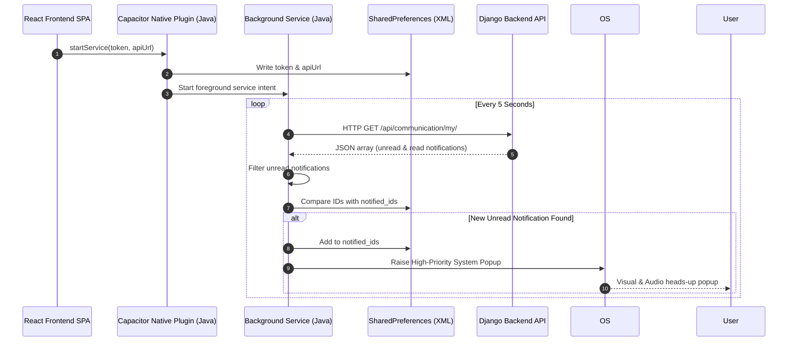

# Technical Documentation: Native Android Background Notification System

This document provides a comprehensive technical overview of the local real-time background notification system implemented within the **School Conduct** mobile application.

---

## 1. Architectural Overview

Since standard push notification services (such as Firebase Cloud Messaging or OneSignal) require a dedicated third-party setup, credentials (`google-services.json`), and dynamic device token registrations, a **native, lightweight background polling service** was built inside the Capacitor Android container.

This design runs entirely on the client device, checking for new alerts directly from the server at a near real-time polling interval.

### Data Flow Diagram



---

## 2. Key Components & Implementation

### A. Manifest Declarations & System Permissions
The following native permissions are defined in `AndroidManifest.xml` to allow the app to query resources and raise popups:
- `android.permission.FOREGROUND_SERVICE`: Runs the service while the app is closed.
- `android.permission.FOREGROUND_SERVICE_DATA_SYNC`: Sets the service type to data synchronization (Android 14+ requirement).
- `android.permission.POST_NOTIFICATIONS`: Prompts the user to permit heads-up notification banners (Android 13+).
- `android.permission.CAMERA`: Standard camera utility permissions.
- `android.permission.READ_MEDIA_IMAGES` / `READ_MEDIA_VIDEO` / `READ_EXTERNAL_STORAGE`: Granular media and file uploads.
- `android.permission.CALL_PHONE` / `READ_PHONE_STATE`: Direct calls.

**Service Declaration in Manifest:**
```xml
<service
    android:name=".BackgroundNotificationService"
    android:enabled="true"
    android:exported="false"
    android:foregroundServiceType="dataSync" />
```

### B. Startup Permission Prompting (`MainActivity.java`)
To prevent the user from having to manually enable permissions in the phone's settings, `MainActivity.java` queries all required permissions natively on the first app initialization:
- Triggers standard system request dialogs immediately when the app launches.
- Ensures all granular media permissions (for both Android 13+ and legacy devices) are covered in a single execution loop.

### C. SharedPreferences Credential Synchronization (`BackgroundNotificationPlugin.java`)
Exposes bridge endpoints to JavaScript (`startService`, `stopService`). When the user logs in:
1. Token and base server URL are saved to Android's `SharedPreferences`.
2. Starts the background service container.
3. Automatically updates credentials upon JWT token updates to prevent HTTP `401 Unauthorized` errors.

### D. Background Polling Service (`BackgroundNotificationService.java`)
This is the core background sync process:
- **Foreground Sticky Loop**: Operates continuously as a foreground sync service, displaying a low-priority status sync icon to prevent the OS from killing the process.
- **5-Second Polling**: Uses a background thread to poll `/api/communication/my/` every 5 seconds.
- **De-duplication**: Maintains a set of notified IDs (`notified_ids`) in local Storage. It will only raise a pop-up alert for a notification if it is marked `is_read = false` in the database and has not yet been notified.
- **High Importance Notification Channel**:
  - Registered under channel ID `"SchoolConductAlerts_v3"`.
  - Configured with `IMPORTANCE_HIGH` to display heads-up banners that slide down over active applications.
  - Custom sound, vibration, and public lock screen visibility are enabled.

---

## 3. On-Device File Logger Diagnostic Tool (`FileLogger.java`)

Due to strict Android 10+ Scoped Storage restrictions, writing directly to the shared `Download` directory is blocked. To address this, a custom diagnostic logger writes logs directly to the application's secure external storage directory:

- **Log File Location**: `/sdcard/Android/data/com.schoolconduct.app/files/schoolconduct_log.txt`
- **Tracked Parameters**:
  - Service lifecycle states (`onCreate`, `onStartCommand`).
  - Network requests, endpoints, and HTTP status codes (e.g. `200 OK`).
  - Fetched items count and JSON elements.
  - Detailed Java exception stack traces.

---

## 4. Backend Notification Generation (Django REST Framework)

Whenever an action occurs, the backend writes a database entry to the `communication_notification` table:
- **Attendance**: Triggered on `post_save` of an approved/rejected attendance entry, targeting the Student User.
- **Assignments**: Triggers when a teacher creates a new assignment, creating notifications for all students in the assigned class section.
- **Exams / Results**: Triggers when exams are scheduled or test scores are released.
- **Announcements**: Dispatched to target audiences (All, Students, or Teachers) depending on the publication filter.
- **Private & Doubt Messaging**: Triggers whenever a direct chat message or a doubt thread reply is sent to a recipient.
